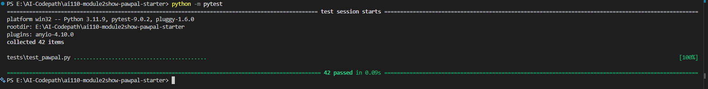

# PawPal+ (Module 2 Project)

You are building **PawPal+**, a Streamlit app that helps a pet owner plan care tasks for their pet.

## Scenario

A busy pet owner needs help staying consistent with pet care. They want an assistant that can:

- Track pet care tasks (walks, feeding, meds, enrichment, grooming, etc.)
- Consider constraints (time available, priority, owner preferences)
- Produce a daily plan and explain why it chose that plan

Your job is to design the system first (UML), then implement the logic in Python, then connect it to the Streamlit UI.

## What you will build

Your final app should:

- Let a user enter basic owner + pet info
- Let a user add/edit tasks (duration + priority at minimum)
- Generate a daily schedule/plan based on constraints and priorities
- Display the plan clearly (and ideally explain the reasoning)
- Include tests for the most important scheduling behaviors

## Getting started

### Setup

```bash
python -m venv .venv
source .venv/bin/activate  # Windows: .venv\Scripts\activate
pip install -r requirements.txt
```

### Suggested workflow

1. Read the scenario carefully and identify requirements and edge cases.
2. Draft a UML diagram (classes, attributes, methods, relationships).
3. Convert UML into Python class stubs (no logic yet).
4. Implement scheduling logic in small increments.
5. Add tests to verify key behaviors.
6. Connect your logic to the Streamlit UI in `app.py`.
7. Refine UML so it matches what you actually built.

---

## Smarter Scheduling

Beyond basic priority-based planning, PawPal+ includes four algorithmic improvements that make the scheduler more useful in practice.

### 1. Sort by time — `Scheduler.sort_by_time(scheduled_tasks)`

Takes any list of `ScheduledTask` objects and returns them sorted from earliest to latest start time. Uses a `lambda` with an integer-tuple key so `"09:05"` always sorts before `"09:30"`, regardless of zero-padding.

```python
sorted_plan = Scheduler.sort_by_time(my_schedule)
```

### 2. Filter tasks — `Scheduler.filter_tasks(tasks, pet_name=..., completed=...)`

Filters a flat task list by pet name, completion status, or both combined. Both filters are optional keyword-only arguments.

```python
# Only Mochi's incomplete tasks
pending = Scheduler.filter_tasks(owner.get_all_tasks(), pet_name="Mochi", completed=False)
```

### 3. Recurring tasks — `Task.mark_complete()`

When a task has `frequency="daily"` or `frequency="weekly"`, calling `mark_complete()` returns a new `Task` with `due_date` advanced by 1 or 7 days using Python's `timedelta`. One-off tasks return `None`.

```python
next_task = morning_walk.mark_complete()   # returns tomorrow's walk
if next_task:
    pet.add_task(next_task)
```

### 4. Conflict detection — `Scheduler.detect_conflicts()`

After generating a schedule, checks every pair of `ScheduledTask` entries for overlapping time windows. Returns a list of human-readable warning strings rather than crashing. An empty list means the schedule is conflict-free.

```python
warnings = scheduler.detect_conflicts()
for w in warnings:
    print(f"[!] {w}")
# [!] CONFLICT: 'Walk in park' (09:00-09:30) overlaps 'Vet appointment' (09:15-09:35)
```

**Tradeoff:** Conflict detection uses a lightweight O(n²) pairwise check. It identifies exact minute-level overlaps and reports them as warnings, but does not attempt to auto-resolve them. This keeps the code readable and the output transparent for the owner.

---

## Testing PawPal+

### Run the tests

```bash
python -m pytest
```

For verbose output showing every test name:

```bash
python -m pytest -v
```

### What the tests cover

The suite lives in `tests/test_pawpal.py` and contains **42 tests** across 6 groups:

| Group | # Tests | What is verified |
|---|---|---|
| **Task basics** | 10 | Completion status, task addition, priority validation, senior-pet thresholds, pet-name tagging |
| **Sorting** | 5 | Chronological order, already-sorted input, single item, empty list, no mutation of original |
| **Recurrence** | 7 | Daily/weekly next-task creation, correct due dates via `timedelta`, field preservation, one-off returns `None` |
| **Conflict detection** | 6 | Overlap flagged, back-to-back not flagged, empty/single-task edge cases, three-way overlap reports all pairs |
| **Filtering** | 7 | Filter by pet name (case-insensitive), by completion status, combined filters, empty input |
| **Scheduler** | 7 | Priority ordering, time-budget enforcement, repeated-call reset, empty pet, remaining-minutes counter, end-time arithmetic |

### Key edge cases covered

- A pet with **no tasks** produces an empty schedule (not a crash)
- A task **longer than the time budget** is silently skipped
- Two tasks at **exactly the same start time** are flagged as a conflict
- Two tasks placed **back-to-back** (end == next start) are correctly *not* flagged
- Calling `generate_schedule()` **twice** does not duplicate tasks in the output
- A recurring task with **no `due_date` set** falls back to `date.today()` as the base

### Test results



### Confidence level

**★★★★☆ (4 / 5)**

The core scheduling logic — priority ordering, time budgeting, recurrence, conflict detection, sorting, and filtering — is fully covered by automated tests. The remaining gap is the Streamlit UI layer (`app.py`), which is not covered by unit tests and would require browser-level or snapshot testing to verify end-to-end.
