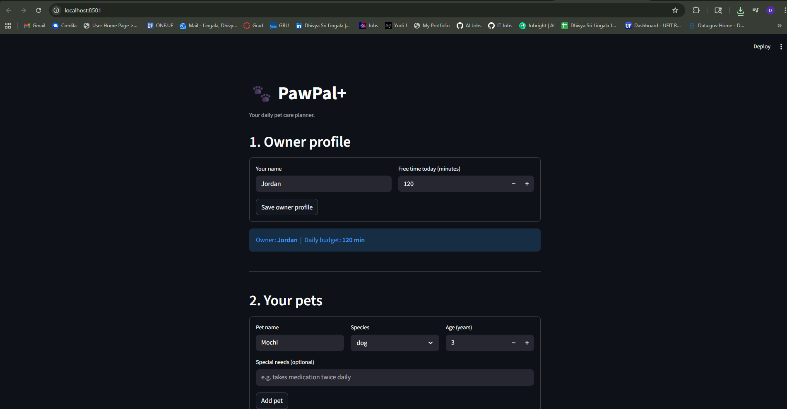
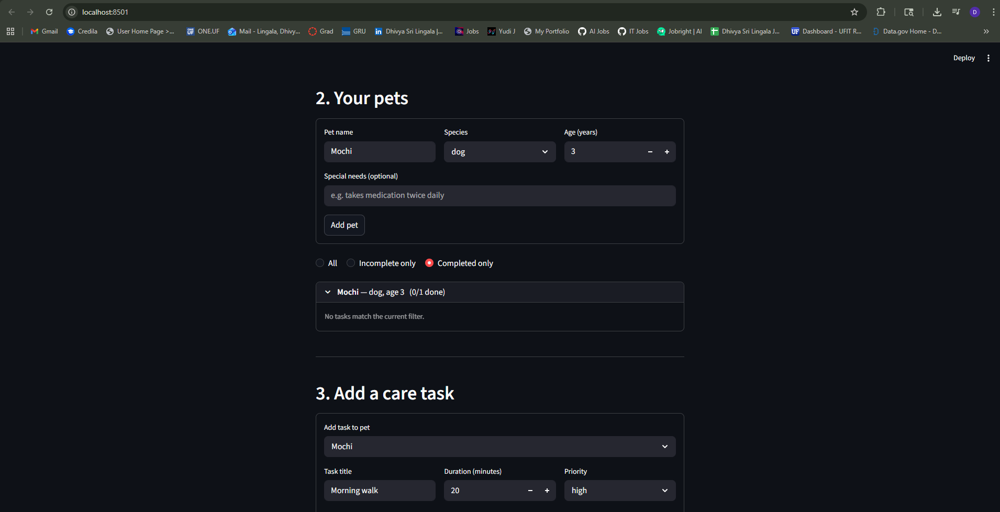
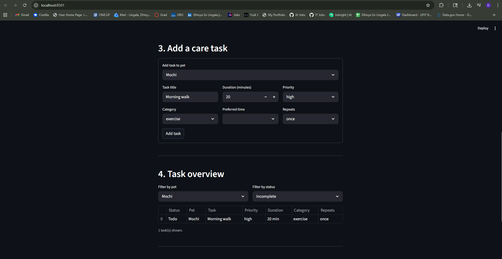
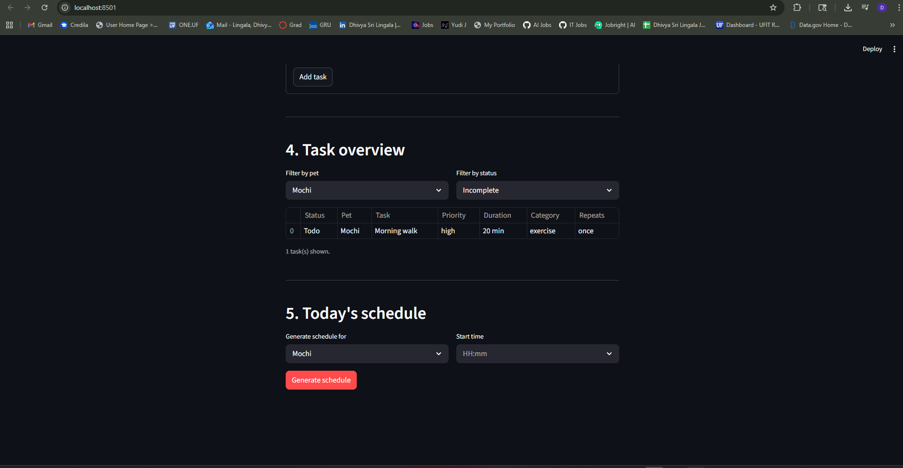
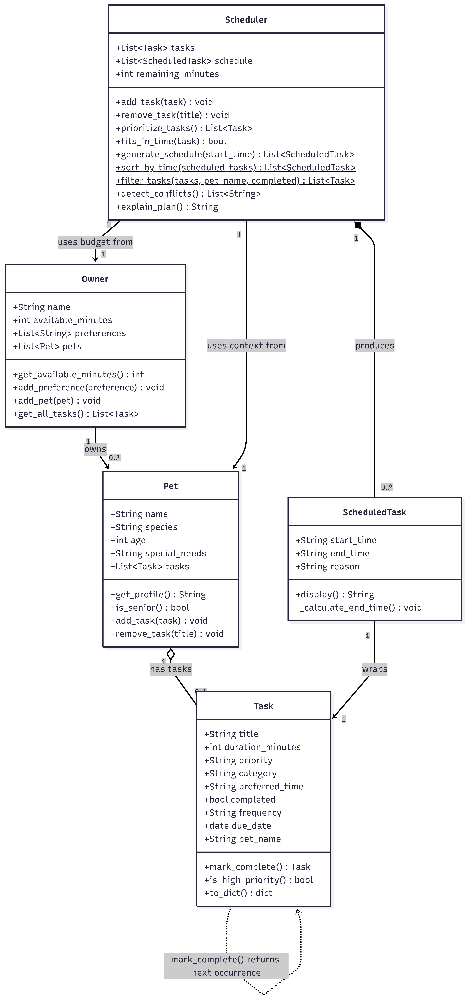

# 🐾 PawPal+

> **A smart daily pet care planner built with Python and Streamlit.**
> PawPal+ helps busy pet owners stay consistent with pet care by generating a
> prioritised, conflict-free daily schedule for each of their pets.

---

## 📋 Table of Contents

1. [Overview](#overview)
2. [Features](#features)
3. [Demo](#demo)
4. [Architecture](#architecture)
5. [Getting Started](#getting-started)
6. [Project Structure](#project-structure)
7. [Smarter Scheduling](#smarter-scheduling)
8. [Testing PawPal+](#testing-pawpal)
9. [UML Design](#uml-design)

---

## Overview

A busy pet owner needs help staying consistent with pet care. PawPal+ acts as a
daily planning assistant that:

- Tracks care tasks (walks, feeding, medication, grooming, enrichment, and more)
- Considers constraints — available time, task priority, and pet-specific needs
- Produces a clear daily plan with plain-English reasoning for each scheduled slot
- Warns the owner about scheduling conflicts before they become a problem
- Handles recurring tasks (daily / weekly) automatically

---

## Features

### Core features

| Feature | Description |
|---|---|
| **Owner profile** | Set your name and daily time budget (minutes available today) |
| **Multi-pet support** | Add multiple pets; each has its own task list and profile |
| **Senior-pet detection** | Dogs ≥ 8 yrs and cats ≥ 11 yrs are flagged `[Senior]`; the scheduler adds a gentle-activity note for exercise tasks |
| **Task management** | Add tasks with title, duration, priority (low/medium/high), category, and preferred time-of-day |
| **Priority scheduling** | High-priority tasks (medication, feeding) are always placed before lower-priority ones |
| **Time-budget enforcement** | Tasks that exceed the remaining daily budget are skipped and listed separately |
| **Schedule reasoning** | Every scheduled slot includes a plain-English explanation of why it was placed there |

### Smart scheduling algorithms

| Algorithm | Method | Description |
|---|---|---|
| **Sorting by time** | `Scheduler.sort_by_time()` | Sorts the generated schedule chronologically using an integer-tuple lambda key — reliable for any `HH:MM` format |
| **Task filtering** | `Scheduler.filter_tasks()` | Filters tasks by pet name and/or completion status; both filters are optional and combinable |
| **Recurring tasks** | `Task.mark_complete()` | Marks a task done and auto-creates the next occurrence using Python `timedelta` — `+1 day` for daily, `+7 days` for weekly |
| **Conflict detection** | `Scheduler.detect_conflicts()` | Pairwise O(n²) check for overlapping time windows; returns human-readable warning strings rather than crashing |

---

## 📸 Demo

### 1 — Owner profile and pet setup

<a href="Streamlit_demo_1.png" target="_blank">
  
</a>

---

### 2 — Adding care tasks with recurrence

<a href="Streamlit_demo_2.png" target="_blank">
  
</a>

---

### 3 — Task overview and filtering

<a href="Streamlit_demo_3.png" target="_blank">
  
</a>

---

### 4 — Generated schedule with conflict warnings

<a href="Streamlit_demo_4.png" target="_blank">
  
</a>

---

## Architecture

```
pawpal_system.py   ← Logic layer (Owner, Pet, Task, ScheduledTask, Scheduler)
app.py             ← Streamlit UI — bridges user actions to logic layer
main.py            ← CLI demo / testing ground
tests/
  test_pawpal.py   ← 42 automated pytest tests
uml_final.md       ← Final Mermaid.js class diagram
```

**Data-flow design:**

```
Owner
 └── pets: list[Pet]
       └── tasks: list[Task]          ← tasks live on their pet
             │
             ▼
       owner.get_all_tasks()          ← Owner aggregates all tasks
             │
             ▼
       Scheduler.generate_schedule()  ← schedules, sorts, detects conflicts
             │
             ▼
       list[ScheduledTask]            ← output: time slot + reason per task
```

`st.session_state.owner` in `app.py` holds the entire object graph so nothing
is lost on Streamlit reruns.

---

## Getting Started

### Prerequisites

- Python 3.11+
- pip

### Setup

```bash
# 1 — Clone the repo
git clone https://github.com/DhivyaSriLingala/ai110-module2show-pawpal-starter.git
cd ai110-module2show-pawpal-starter

# 2 — Create and activate a virtual environment
python -m venv .venv
source .venv/bin/activate        # macOS / Linux
.venv\Scripts\activate           # Windows

# 3 — Install dependencies
pip install -r requirements.txt

# 4 — Run the Streamlit app
streamlit run app.py

# 5 — (Optional) Run the CLI demo
python main.py
```

---

## Project Structure

```
ai110-module2show-pawpal-starter/
├── app.py               Streamlit UI
├── pawpal_system.py     Logic layer (all five classes)
├── main.py              CLI demo script
├── requirements.txt
├── uml_final.md         Final Mermaid.js class diagram
├── reflection.md        Design decisions and project reflection
├── tests/
│   └── test_pawpal.py   42 automated tests (pytest)
└── *.png                Screenshots and diagrams
```

---

## Smarter Scheduling

Beyond basic priority-based planning, PawPal+ includes four algorithmic
improvements that make the scheduler more useful in practice.

### 1. Sort by time — `Scheduler.sort_by_time(scheduled_tasks)`

Takes any list of `ScheduledTask` objects and returns them sorted from earliest
to latest start time. Uses a `lambda` with an integer-tuple key so `"09:05"`
always sorts before `"09:30"`, regardless of zero-padding.

```python
sorted_plan = Scheduler.sort_by_time(my_schedule)
```

### 2. Filter tasks — `Scheduler.filter_tasks(tasks, pet_name=..., completed=...)`

Filters a flat task list by pet name, completion status, or both combined.
Both filters are optional keyword-only arguments.

```python
# Only Mochi's incomplete tasks
pending = Scheduler.filter_tasks(owner.get_all_tasks(), pet_name="Mochi", completed=False)
```

### 3. Recurring tasks — `Task.mark_complete()`

When a task has `frequency="daily"` or `frequency="weekly"`, calling
`mark_complete()` returns a new `Task` with `due_date` advanced by 1 or 7 days
using Python's `timedelta`. One-off tasks return `None`.

```python
next_task = morning_walk.mark_complete()   # returns tomorrow's walk
if next_task:
    pet.add_task(next_task)
```

### 4. Conflict detection — `Scheduler.detect_conflicts()`

After generating a schedule, checks every pair of `ScheduledTask` entries for
overlapping time windows. Returns a list of human-readable warning strings
rather than crashing. An empty list means the schedule is conflict-free.

```python
warnings = scheduler.detect_conflicts()
for w in warnings:
    print(f"[!] {w}")
# [!] CONFLICT: 'Walk in park' (09:00-09:30) overlaps 'Vet appointment' (09:15-09:35)
```

**Tradeoff:** Conflict detection uses a lightweight O(n²) pairwise check. It
identifies exact minute-level overlaps and reports them as warnings, but does
not attempt to auto-resolve them. This keeps the code readable and the output
transparent for the owner.

---

## Testing PawPal+

### Run the tests

```bash
python -m pytest
```

For verbose output showing every test name:

```bash
python -m pytest -v
```

### What the tests cover

The suite lives in `tests/test_pawpal.py` and contains **42 tests** across 6 groups:

| Group | # Tests | What is verified |
|---|---|---|
| **Task basics** | 10 | Completion status, task addition, priority validation, senior-pet thresholds, pet-name tagging |
| **Sorting** | 5 | Chronological order, already-sorted input, single item, empty list, no mutation of original |
| **Recurrence** | 7 | Daily/weekly next-task creation, correct due dates via `timedelta`, field preservation, one-off returns `None` |
| **Conflict detection** | 6 | Overlap flagged, back-to-back not flagged, empty/single-task edge cases, three-way overlap reports all pairs |
| **Filtering** | 7 | Filter by pet name (case-insensitive), by completion status, combined filters, empty input |
| **Scheduler** | 7 | Priority ordering, time-budget enforcement, repeated-call reset, empty pet, remaining-minutes counter, end-time arithmetic |

### Key edge cases covered

- A pet with **no tasks** produces an empty schedule (not a crash)
- A task **longer than the time budget** is silently skipped
- Two tasks at **exactly the same start time** are flagged as a conflict
- Two tasks placed **back-to-back** (end == next start) are correctly *not* flagged
- Calling `generate_schedule()` **twice** does not duplicate tasks in the output
- A recurring task with **no `due_date` set** falls back to `date.today()` as the base

### Test results


### Confidence level

**★★★★☆ (4 / 5)**

The core scheduling logic — priority ordering, time budgeting, recurrence,
conflict detection, sorting, and filtering — is fully covered by automated tests.
The remaining gap is the Streamlit UI layer (`app.py`), which is not covered by
unit tests and would require browser-level or snapshot testing to verify end-to-end.

---

## UML Design

The final class diagram (updated to reflect the complete implementation) lives
in [`uml_final.md`](uml_final.md). Paste the Mermaid block into
[mermaid.live](https://mermaid.live) to view or export it.


