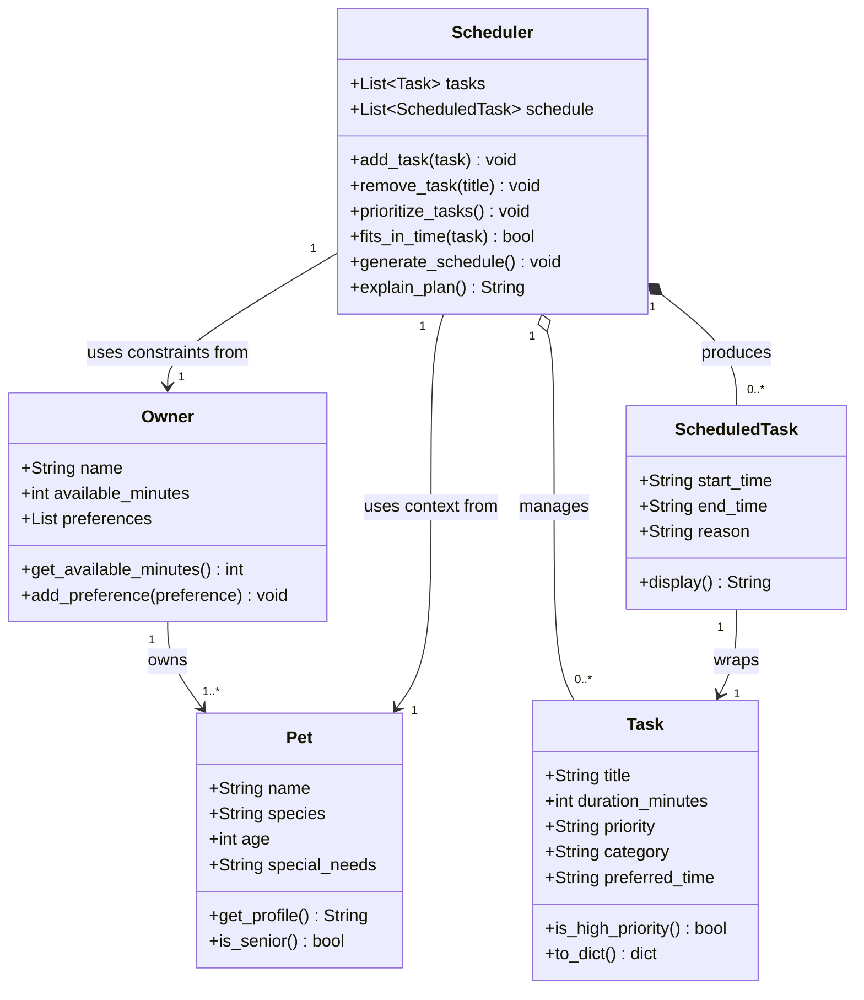

# PawPal+ Project Reflection

## 1. System Design

**a. Core user actions**

The three core actions a user should be able to perform in PawPal+ are:

1. **Add a pet and owner profile** — The user enters basic information about themselves (name, available time in the day) and their pet (name, species, age). This context shapes which tasks are relevant and how the scheduler prioritizes them. For example, a senior dog may need shorter, more frequent walks rather than one long outing.

2. **Add and manage care tasks** — The user creates tasks representing things that need to happen during the day (morning walk, feeding, medication, grooming, enrichment play, etc.). Each task carries at minimum a title, an estimated duration in minutes, and a priority level (low / medium / high). The user should also be able to remove or edit existing tasks before generating a schedule.

3. **Generate and view today's schedule** — The user triggers the scheduler, which takes the task list, the owner's available time, and task priorities, then produces an ordered daily plan. The plan should display each task with its suggested time slot and a brief explanation of why it was placed there (e.g., "Morning walk scheduled first — high priority and best done before the owner leaves for work").

**b. Building blocks (objects, attributes, and methods)**

Below are the main objects identified for the PawPal+ system:

---

### `Owner`
Represents the person who cares for the pet.

| Attributes | Description |
|---|---|
| `name` | Owner's display name |
| `available_minutes` | Total free time available in the day (e.g., 180) |
| `preferences` | Optional list of preferences (e.g., "prefer morning walks") |

| Methods | Description |
|---|---|
| `get_available_minutes()` | Returns how many minutes are left for scheduling |
| `add_preference(preference)` | Appends a new preference string to the list |

---

### `Pet`
Represents the animal being cared for.

| Attributes | Description |
|---|---|
| `name` | Pet's name |
| `species` | Type of animal (dog, cat, other) |
| `age` | Age in years — used to adjust task intensity or frequency |
| `special_needs` | Optional notes (e.g., "takes medication twice daily") |

| Methods | Description |
|---|---|
| `get_profile()` | Returns a readable summary of the pet's info |
| `is_senior()` | Returns `True` if the pet's age qualifies as senior, to flag gentler scheduling |

---

### `Task`
Represents a single care activity that needs to happen during the day.

| Attributes | Description |
|---|---|
| `title` | Short name for the task (e.g., "Morning walk") |
| `duration_minutes` | How long the task takes |
| `priority` | Importance level: `"low"`, `"medium"`, or `"high"` |
| `category` | Type of task (e.g., exercise, feeding, grooming, medication) |
| `preferred_time` | Optional hint for when to schedule it (e.g., "morning", "evening") |

| Methods | Description |
|---|---|
| `is_high_priority()` | Returns `True` if priority is `"high"` |
| `to_dict()` | Returns the task as a dictionary (useful for display and storage) |

---

### `ScheduledTask`
Represents a `Task` that has been placed into a specific time slot in the day's plan.

| Attributes | Description |
|---|---|
| `task` | Reference to the original `Task` object |
| `start_time` | When the task begins (e.g., `"08:00"`) |
| `end_time` | When the task ends, derived from start + duration |
| `reason` | Plain-language explanation of why this task was placed here |

| Methods | Description |
|---|---|
| `display()` | Returns a formatted string like `"08:00–08:20 Morning walk (high priority)"` |

---

### `Scheduler`
The core engine that takes all inputs and produces an ordered daily plan.

| Attributes | Description |
|---|---|
| `owner` | The `Owner` object providing time constraints |
| `pet` | The `Pet` object providing context for task suitability |
| `tasks` | List of `Task` objects to be scheduled |
| `schedule` | Ordered list of `ScheduledTask` objects (the output plan) |

| Methods | Description |
|---|---|
| `add_task(task)` | Adds a new `Task` to the task list |
| `remove_task(title)` | Removes a task by its title |
| `prioritize_tasks()` | Sorts tasks by priority (high → medium → low) |
| `fits_in_time(task)` | Checks whether a task's duration fits within remaining available time |
| `generate_schedule()` | Runs the scheduling logic and populates `self.schedule` |
| `explain_plan()` | Returns a human-readable summary of the full day's plan |

---

**c. Initial design — Mermaid.js Class Diagram**

The diagram below shows all five classes, their attributes and methods, and how they relate to each other.

> **Diagram Review Notes**
> The diagram was reviewed against three criteria: logical relationships, rendering clarity, and unnecessary complexity. Four issues were found and corrected:
> 1. **Added `Owner → Pet` (owns)** — this real-world relationship was missing entirely.
> 2. **Removed `+Task task` from `ScheduledTask` box** — it was already expressed by the `ScheduledTask → Task` arrow; keeping both causes double-rendering.
> 3. **Removed `+Owner owner` and `+Pet pet` from `Scheduler` box** — same reason; the arrows carry this information.
> 4. **Changed `Scheduler → ScheduledTask` from association (`-->`) to composition (`*--`)** — `ScheduledTask` objects are created and owned by the Scheduler; they cannot exist independently.

**b. Design changes**

- Did your design change during implementation?
- If yes, describe at least one change and why you made it.

---

## 2. Scheduling Logic and Tradeoffs

**a. Constraints and priorities**

- What constraints does your scheduler consider (for example: time, priority, preferences)?
- How did you decide which constraints mattered most?

**b. Tradeoffs**

- Describe one tradeoff your scheduler makes.
- Why is that tradeoff reasonable for this scenario?

---

## 3. AI Collaboration

**a. How you used AI**

- How did you use AI tools during this project (for example: design brainstorming, debugging, refactoring)?
- What kinds of prompts or questions were most helpful?

**b. Judgment and verification**

- Describe one moment where you did not accept an AI suggestion as-is.
- How did you evaluate or verify what the AI suggested?

---

## 4. Testing and Verification

**a. What you tested**

- What behaviors did you test?
- Why were these tests important?

**b. Confidence**

- How confident are you that your scheduler works correctly?
- What edge cases would you test next if you had more time?

---

## 5. Reflection

**a. What went well**

- What part of this project are you most satisfied with?

**b. What you would improve**

- If you had another iteration, what would you improve or redesign?

**c. Key takeaway**

- What is one important thing you learned about designing systems or working with AI on this project?
