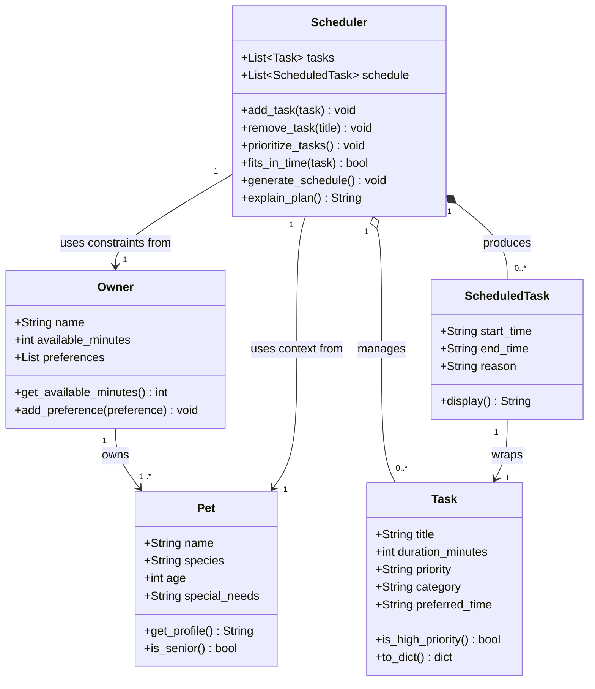
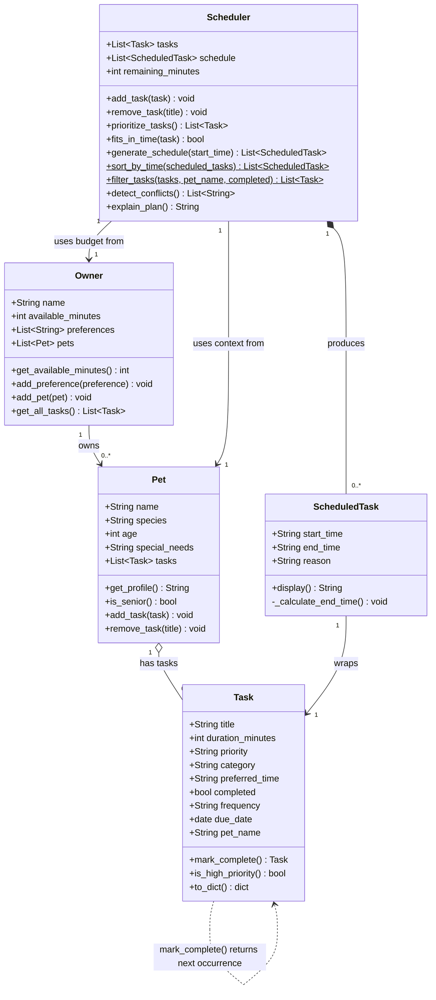

# PawPal+ Project Reflection

## 1. System Design

**a. Core user actions**

The three core actions a user should be able to perform in PawPal+ are:

1. **Add a pet and owner profile** — The user enters basic information about themselves (name, available time in the day) and their pet (name, species, age). This context shapes which tasks are relevant and how the scheduler prioritizes them. For example, a senior dog may need shorter, more frequent walks rather than one long outing.

2. **Add and manage care tasks** — The user creates tasks representing things that need to happen during the day (morning walk, feeding, medication, grooming, enrichment play, etc.). Each task carries at minimum a title, an estimated duration in minutes, and a priority level (low / medium / high). The user should also be able to remove or edit existing tasks before generating a schedule.

3. **Generate and view today's schedule** — The user triggers the scheduler, which takes the task list, the owner's available time, and task priorities, then produces an ordered daily plan. The plan should display each task with its suggested time slot and a brief explanation of why it was placed there (e.g., "Morning walk scheduled first — high priority and best done before the owner leaves for work").

**b. Building blocks (objects, attributes, and methods)**

Below are the main objects identified for the PawPal+ system:

---

### `Owner`
Represents the person who cares for the pet.

| Attributes | Description |
|---|---|
| `name` | Owner's display name |
| `available_minutes` | Total free time available in the day (e.g., 180) |
| `preferences` | Optional list of preferences (e.g., "prefer morning walks") |

| Methods | Description |
|---|---|
| `get_available_minutes()` | Returns how many minutes are left for scheduling |
| `add_preference(preference)` | Appends a new preference string to the list |

---

### `Pet`
Represents the animal being cared for.

| Attributes | Description |
|---|---|
| `name` | Pet's name |
| `species` | Type of animal (dog, cat, other) |
| `age` | Age in years — used to adjust task intensity or frequency |
| `special_needs` | Optional notes (e.g., "takes medication twice daily") |

| Methods | Description |
|---|---|
| `get_profile()` | Returns a readable summary of the pet's info |
| `is_senior()` | Returns `True` if the pet's age qualifies as senior, to flag gentler scheduling |

---

### `Task`
Represents a single care activity that needs to happen during the day.

| Attributes | Description |
|---|---|
| `title` | Short name for the task (e.g., "Morning walk") |
| `duration_minutes` | How long the task takes |
| `priority` | Importance level: `"low"`, `"medium"`, or `"high"` |
| `category` | Type of task (e.g., exercise, feeding, grooming, medication) |
| `preferred_time` | Optional hint for when to schedule it (e.g., "morning", "evening") |

| Methods | Description |
|---|---|
| `is_high_priority()` | Returns `True` if priority is `"high"` |
| `to_dict()` | Returns the task as a dictionary (useful for display and storage) |

---

### `ScheduledTask`
Represents a `Task` that has been placed into a specific time slot in the day's plan.

| Attributes | Description |
|---|---|
| `task` | Reference to the original `Task` object |
| `start_time` | When the task begins (e.g., `"08:00"`) |
| `end_time` | When the task ends, derived from start + duration |
| `reason` | Plain-language explanation of why this task was placed here |

| Methods | Description |
|---|---|
| `display()` | Returns a formatted string like `"08:00–08:20 Morning walk (high priority)"` |

---

### `Scheduler`
The core engine that takes all inputs and produces an ordered daily plan.

| Attributes | Description |
|---|---|
| `owner` | The `Owner` object providing time constraints |
| `pet` | The `Pet` object providing context for task suitability |
| `tasks` | List of `Task` objects to be scheduled |
| `schedule` | Ordered list of `ScheduledTask` objects (the output plan) |

| Methods | Description |
|---|---|
| `add_task(task)` | Adds a new `Task` to the task list |
| `remove_task(title)` | Removes a task by its title |
| `prioritize_tasks()` | Sorts tasks by priority (high → medium → low) |
| `fits_in_time(task)` | Checks whether a task's duration fits within remaining available time |
| `generate_schedule()` | Runs the scheduling logic and populates `self.schedule` |
| `explain_plan()` | Returns a human-readable summary of the full day's plan |

---

**c. Initial design — Class descriptions and responsibilities**

The system is built around five classes. Each one has a single, clear responsibility so that they stay easy to test and modify independently.

| Class | Responsibility |
|---|---|
| `Owner` | Holds the human side of the relationship — who the user is, how much time they have today, and any scheduling preferences (e.g. "prefer morning walks"). It is the source of the **time budget** the scheduler must respect. |
| `Pet` | Holds the animal's profile — name, species, age, and any special needs. Its `is_senior()` method lets the scheduler make gentler choices (shorter durations, lower-intensity tasks) for older animals without hardcoding that logic elsewhere. |
| `Task` | Represents one care activity. It is a pure **data object** (implemented as a Python dataclass) that carries everything the scheduler needs to decide whether and when to include the task: title, duration, priority, category, and an optional preferred time-of-day hint. |
| `ScheduledTask` | A **wrapper** that pairs a `Task` with a concrete time slot (`start_time`, `end_time`) and a plain-English `reason`. It is the output unit — one `ScheduledTask` = one line in the displayed plan. |
| `Scheduler` | The **engine**. It accepts an `Owner` and a `Pet`, manages the task pool, and runs the scheduling algorithm (`generate_schedule`). It is the only class that needs to know about all the others, keeping coupling to a single place. |

**Relationships between classes:**
- `Owner` owns one or more `Pet` objects (real-world belonging).
- `Scheduler` reads from `Owner` (time budget) and `Pet` (context) but does not own them — they are passed in from outside.
- `Scheduler` aggregates `Task` objects (tasks exist independently and can be reused or edited before scheduling).
- `Scheduler` composes `ScheduledTask` objects (they are created by and belong entirely to the scheduler's output; they have no life outside a generated plan).
- Each `ScheduledTask` wraps exactly one `Task`.

**c. Initial design — Mermaid.js Class Diagram**

The diagram below shows all five classes, their attributes and methods, and how they relate to each other.



> **Diagram Review Notes**
> The diagram was reviewed against three criteria: logical relationships, rendering clarity, and unnecessary complexity. Four issues were found and corrected:
> 1. **Added `Owner → Pet` (owns)** — this real-world relationship was missing entirely.
> 2. **Removed `+Task task` from `ScheduledTask` box** — it was already expressed by the `ScheduledTask → Task` arrow; keeping both causes double-rendering.
> 3. **Removed `+Owner owner` and `+Pet pet` from `Scheduler` box** — same reason; the arrows carry this information.
> 4. **Changed `Scheduler → ScheduledTask` from association (`-->`) to composition (`*--`)** — `ScheduledTask` objects are created and owned by the Scheduler; they cannot exist independently.

---

**d. Final design — updated UML after full implementation**

After completing all phases the initial diagram was compared against the final `pawpal_system.py`. Ten differences were found:



| # | What changed from initial design | Why |
|---|---|---|
| 1 | `Owner` gained `pets`, `add_pet()`, `get_all_tasks()` | Tasks flow Owner → Pet → Task; Scheduler pulls via `get_all_tasks()` |
| 2 | `Pet` gained `tasks` list, `add_task()`, `remove_task()` | Tasks live on the pet they belong to, not on the Scheduler |
| 3 | `Task` gained `completed`, `frequency`, `due_date`, `pet_name` | Completion tracking, recurring tasks, and cross-pet filtering |
| 4 | `Task.mark_complete()` returns `Task` (not `void`) | Returns next occurrence for daily/weekly tasks via `timedelta` |
| 5 | `Scheduler` gained `remaining_minutes` | `fits_in_time()` needs a live budget counter, not just the total |
| 6 | `Scheduler.sort_by_time()` added (`$` = static) | Sorts output chronologically for display |
| 7 | `Scheduler.filter_tasks()` added (`$` = static) | Filters task pool by `pet_name` and/or `completed` |
| 8 | `Scheduler.detect_conflicts()` added | Pairwise overlap check returning human-readable warnings |
| 9 | `Pet o-- Task` replaces `Scheduler o-- Task` | Tasks are owned by pets, not by the scheduler |
| 10 | `Task ..> Task` self-link added | Expresses that `mark_complete()` can produce a new `Task` instance |

**b. Design changes**

After generating the class skeleton, the skeleton was reviewed using the following prompt against `pawpal_system.py`:

> *"Review this skeleton. Does it match the UML diagram? Are there any missing relationships or potential logic bottlenecks?"*

Three issues were identified and acted on:

---

**Change 1 — Added `pets` list and `add_pet()` to `Owner`**

- **What the AI noticed:** The UML diagram explicitly shows `Owner "1" --> "1..*" Pet : owns`, but the original skeleton had no `pets` attribute on `Owner` at all. The relationship existed in the diagram but was silently dropped when translating to code.
- **What changed:** Added `self.pets: list[Pet] = []` to `Owner.__init__` and a new `add_pet(pet)` method stub.
- **Why accepted:** The UML diagram was deliberately designed to include this relationship for a reason — an owner can have more than one pet, and future features (multi-pet scheduling) depend on it being there. Leaving it out would have required a breaking change later.

---

**Change 2 — Added `__post_init__` validation to `Task`**

- **What the AI noticed:** `Task.priority` is declared as a plain `str` with a comment saying it should be `'low' | 'medium' | 'high'`, but nothing enforces that. Passing `"urgent"` or `"High"` would be silently accepted and would break `prioritize_tasks()` at runtime with no helpful error message.
- **What changed:** Added a `__post_init__` method to the `Task` dataclass that normalises priority to lowercase and raises a clear `ValueError` for unrecognised values. Added a module-level `VALID_PRIORITIES` constant so the valid options are defined in one place.
- **Why accepted:** Silent data bugs are harder to trace than loud ones. Failing fast with a readable error message at the point of bad input is better than a confusing crash deep inside the scheduler.

---

**Change 3 — Added `remaining_minutes` attribute to `Scheduler`**

- **What the AI noticed:** `fits_in_time(task)` was supposed to check whether a task fits in the available time, but `Scheduler` only stored `owner.available_minutes` (the full day budget). There was no field tracking how many minutes had already been consumed by previously scheduled tasks. Without it, `fits_in_time()` would have no correct value to compare against after the first task was added.
- **What changed:** Added `self.remaining_minutes: int = owner.available_minutes` to `Scheduler.__init__`. This value will be decremented inside `generate_schedule()` as each task is added to the plan.
- **Why accepted:** This is a genuine logic bottleneck — the scheduling loop cannot work correctly without a live count of remaining time. It was a missing piece, not a style preference.

---

## 2. Scheduling Logic and Tradeoffs

**a. Constraints and priorities**

The scheduler considers three constraints, in this order of importance:

1. **Time budget** — `owner.available_minutes` is the hard outer limit. A task that would push the total over budget is skipped entirely, not truncated. This is the highest-priority constraint because the owner cannot create more time in the day.

2. **Task priority** — Within the time budget, tasks are sorted high → medium → low before placement. High-priority tasks (medication, feeding) are always placed before lower-priority ones like grooming or enrichment play, regardless of their preferred time hint.

3. **Preferred time** — `preferred_time` is a soft hint ("morning", "evening") that is embedded in the reason string but does not change task order. It was ranked lowest because enforcing it strictly would require time-window logic that significantly complicates the scheduler for limited real-world gain — most pet care tasks have some flexibility.

**Why this ordering:** Medication and feeding cannot be skipped; grooming can. Time is finite and non-negotiable. Preferred time is a preference, not a requirement.

**b. Tradeoffs**

**Tradeoff: lightweight conflict detection checks exact minute-level overlap, not intent.**

The `detect_conflicts()` method uses a pairwise comparison to find any two scheduled tasks whose time windows overlap (i.e. one starts before the other ends). This means it catches real overlaps like:

```
09:00-09:30  Walk in park
09:15-09:35  Vet appointment  ← flagged: starts before Walk ends
```

But it does **not** attempt to resolve the conflict — it returns a warning string and leaves the schedule unchanged. It also does not detect "soft" conflicts, such as two tasks that are individually fine but leave no gap for travel time between them.

**Why this tradeoff is reasonable:** The alternative — a full constraint-satisfaction solver — would be far more complex to implement, test, and explain to a non-technical user. For a daily pet care schedule with fewer than ~20 tasks, the pairwise O(n²) check is instantaneous and the results are easy to understand. A warning that says *"Walk in park (09:00-09:30) overlaps Vet appointment (09:15-09:35)"* gives the owner exactly the information they need to fix the problem manually. Crashing the program or silently rearranging the schedule would be worse than a transparent warning.

---

## 3. AI Collaboration

**a. How you used AI — Copilot feature breakdown**

AI was used across every phase of the project, but the role it played shifted depending on the phase:

| Phase | How AI was used |
|---|---|
| **Design (Phase 1)** | Brainstorming class responsibilities; reviewing the Mermaid UML diagram for missing relationships and redundant arrows |
| **Implementation (Phase 2)** | Generating class skeletons from UML; writing method bodies for standard patterns (`sort`, `filter`, `timedelta`); catching the `remaining_minutes` logic bottleneck |
| **Algorithms (Phase 3)** | Drafting the conflict-detection pairwise loop; suggesting the integer-tuple lambda key for `sort_by_time()`; brainstorming edge cases for recurring tasks |
| **Testing (Phase 4)** | Drafting the initial test plan ("what are the most important edge cases for a scheduler with sorting and recurring tasks?"); generating fixture patterns; explaining why a back-to-back boundary test matters |
| **UI wiring (Phase 5)** | Suggesting `st.session_state` patterns; helping structure the Streamlit form→method flow |
| **Documentation** | Drafting the README Features table; suggesting the "Smarter Scheduling" section structure |

**Most effective Copilot features:**

1. **Inline Chat on a specific method stub** — pointing Copilot at a single `pass` and asking "implement this" with the surrounding context visible produced accurate, focused code far more reliably than asking in a general chat window. For example: asking it to implement `_calculate_end_time()` with the `start_time: str` type hint visible gave a correct `HH:MM` arithmetic solution on the first try.

2. **`#file:` references in Chat** — using `#file:pawpal_system.py` as context grounded Copilot's answers in the actual code rather than generic Python patterns. When asked "based on my skeleton, how should Scheduler retrieve tasks from Owner's pets?", the answer was specific to the existing class structure, not a textbook answer.

3. **"Review this for missing relationships or bottlenecks"** — asking for a review prompt (rather than "write code") surfaced real issues: the missing `Owner.pets` attribute and the absent `remaining_minutes` counter were both caught this way. Review prompts consistently produced more useful output than generation prompts for design work.

4. **Separate chat sessions per phase** — keeping design, implementation, testing, and documentation in different sessions prevented earlier context from polluting later discussions. The testing session in particular benefited from starting fresh — it stayed focused entirely on edge cases rather than drifting into re-explaining the implementation.

**Which prompt types were most helpful:**

- *"Based on #file:X, what are the most important edge cases to test for Y?"* — produced concrete, relevant test scenarios, not generic suggestions.
- *"Review this method. Is the algorithm correct, and is there a simpler way to express it?"* — consistently identified both correctness issues and over-engineering.
- *"Explain this test to me before I accept it"* — forced Copilot to make its reasoning explicit, which made it easier to spot when a test was testing the wrong thing.

---

**b. Judgment and verification — one rejected suggestion**

**The suggestion:** When asked to implement `generate_schedule()`, Copilot's first draft included logic that sorted tasks in-place using `self.tasks.sort(...)`, which mutated the scheduler's internal task pool permanently. This meant that after calling `generate_schedule()` once, the task pool was no longer in insertion order — repeated calls would produce different results, and `add_task()` after the first generation would add new tasks to an already-sorted list with no predictable position.

**Why it was rejected:** The mutation broke the contract that `generate_schedule()` is a read-from-the-pool, write-to-the-schedule operation. It should be callable multiple times with consistent results. The correct approach was to use `sorted(...)` which returns a new list without touching `self.tasks`, and to temporarily swap `self.tasks` only within the scope of the generation loop before restoring it.

**How it was verified:** The test `test_schedule_resets_on_repeated_call` was written specifically to catch this: calling `generate_schedule()` twice must produce the same count of scheduled tasks. It would have failed on the in-place sort version because the second call would have sorted an already-sorted list of a different composition. Running the test suite after switching to `sorted(...)` confirmed the fix without regression.

---

## 4. Testing and Verification

**a. What you tested**

The 42 tests in `tests/test_pawpal.py` cover six groups of behaviour:

1. **Task basics** — The most fundamental guarantees: `completed` starts `False`, flips to `True` after `mark_complete()`, and stays `True` if called again. `add_task()` increases the pet's task count by exactly one. Priority strings are validated at construction time so invalid values fail loudly, not silently.

2. **Sorting** — `sort_by_time()` must return slots in chronological order regardless of input order, must not mutate the original list, and must handle empty and single-item inputs without crashing.

3. **Recurrence** — `mark_complete()` on a daily task must return a new `Task` with `due_date = original + 1 day`; weekly must add 7 days. The next occurrence must inherit all fields and start `completed=False`. One-off tasks must return `None`.

4. **Conflict detection** — Two overlapping time windows must be flagged; back-to-back tasks (end == next start) must **not** be flagged (the boundary is important — it would be a false positive). Three mutually-overlapping tasks must produce all three pairwise warnings. Empty and single-task schedules must return zero conflicts.

5. **Filtering** — `filter_tasks()` by `pet_name` must be case-insensitive. By `completed=True/False` must include/exclude the right tasks. Combined filters must apply both constraints. An empty input list must return an empty list.

6. **Scheduler** — High-priority tasks must appear before low-priority ones in the output. A task longer than the available budget must not appear in the schedule. Calling `generate_schedule()` twice must not duplicate tasks. `remaining_minutes` must decrease by exactly the sum of scheduled durations.

**Why these tests were important:**

The scheduler interacts with every other class — a bug in `prioritize_tasks()` would corrupt the schedule silently, a bug in `fits_in_time()` could either over-commit or under-use the time budget, and a wrong `_calculate_end_time()` would propagate bad data to the conflict detector. Testing each behaviour in isolation made it possible to locate failures precisely rather than debugging the whole system at once.

The back-to-back boundary test for conflict detection was especially important because it guards against a false-positive bug: an off-by-one error in the overlap condition (`<` vs `<=`) would incorrectly flag legitimate consecutive tasks as conflicts and make the UI show warnings on every valid plan.

---

**b. Confidence**

**★★★★☆ (4 / 5)**

All 42 tests pass and cover the full backend logic layer. Confidence is high for:
- Priority ordering under all combinations of task pools
- Time-budget enforcement including edge cases (zero tasks, task exactly equal to budget, task one minute over budget)
- Recurring task date arithmetic for both daily and weekly frequencies
- Conflict detection including the back-to-back boundary
- Filter accuracy for all four combinations of pet/status filters

The remaining gap (the missing star) is the Streamlit UI layer. `app.py` is not covered by automated tests. The following scenarios have only been manually verified:
- The "Done" button correctly triggers `mark_complete()` and adds the next occurrence to the pet
- The conflict warnings display in the correct UI component after schedule generation
- The task filter table updates correctly when the dropdowns are changed

If given more time, the next edge cases to test would be:
- **Two pets with tasks of the same title** — does `filter_tasks(pet_name=...)` correctly isolate them?
- **A schedule generated on day boundary (23:45 + 30 min task)** — `end_time` would roll to `00:15` which is technically the next day; `detect_conflicts()` would misread it as before midnight.
- **Owner with `available_minutes = 0`** — should produce an empty schedule without an error.

---

## 5. Reflection

**a. What went well**

The part of this project I am most satisfied with is the **data-flow architecture** — the decision to have tasks live on `Pet`, be aggregated by `Owner.get_all_tasks()`, and retrieved by `Scheduler` rather than managed directly on the scheduler. This decision emerged from the AI review phase (it was a gap between the initial UML and the skeleton) but once it was in place, every subsequent feature — filtering by pet name, scoping the scheduler to one pet at a time, adding recurring task next-occurrences back to the correct pet — became straightforward. Good data ownership makes features compose cleanly.

The test suite also worked out well. Writing tests for the back-to-back boundary case and the "three-way overlap" scenario forced me to think carefully about the exact semantics of `detect_conflicts()` before implementing it, which caught a potential off-by-one error in the overlap condition before it ever appeared in the UI.

---

**b. What I would improve**

If given another iteration, I would redesign two things:

1. **`preferred_time` is currently inert.** It appears in the reason string but does not affect scheduling order. A real implementation would group tasks by preferred time-of-day into morning/afternoon/evening buckets and schedule each bucket sequentially, respecting priority within each bucket. This would make the plan feel much more natural — feeding at "morning" and medication at "evening" would not both be pushed to 08:00 just because they are both high priority.

2. **The Scheduler is re-created on every "Generate schedule" button click in the UI.** This means any tasks added directly via `scheduler.add_task()` (not attached to a pet) are lost between sessions. The current workaround is to always attach tasks to pets first. A cleaner design would store the `Scheduler` object in `st.session_state` alongside the `Owner`, or remove the scheduler's own task pool entirely and require all tasks to go through `Pet.add_task()`.

---

**c. Key takeaway — being the lead architect**

The most important thing I learned is that **AI is a very fast junior developer, not an architect.** It can generate a correct sorting lambda, draft a fixture, and catch a missing attribute faster than I can type — but it does not know which tradeoffs matter for this specific system. It does not know that `preferred_time` should be a soft hint rather than a hard constraint, or that tasks should live on `Pet` rather than on `Scheduler`, or that the conflict detector should warn rather than auto-resolve. Those decisions came from understanding the user's problem, not from the code itself.

The practical lesson is: **never ask AI to design, only to implement or review.** The prompts that produced the most useful output were always anchored to a specific design decision that had already been made ("implement this method given these constraints") or a specific concern to check ("review this for correctness and missing edge cases"). Open-ended prompts like "build me a scheduler" produced plausible but generic code that needed significant redesign. Constrained prompts produced code that fit cleanly into the existing system.

Using separate chat sessions per phase reinforced this discipline — it prevented earlier design context from leaking into implementation sessions and made it easier to stay focused on the current question. It also made it clearer when a question belonged to a different phase (e.g., asking "should this be a method or a function?" during a testing session is a design question and belongs in a new session with the full architecture in context).
