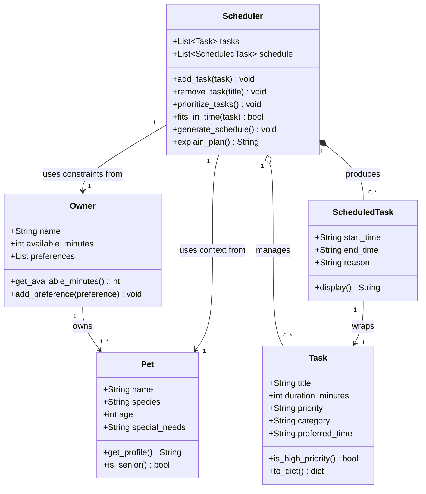

# PawPal+ Project Reflection

## 1. System Design

**a. Core user actions**

The three core actions a user should be able to perform in PawPal+ are:

1. **Add a pet and owner profile** — The user enters basic information about themselves (name, available time in the day) and their pet (name, species, age). This context shapes which tasks are relevant and how the scheduler prioritizes them. For example, a senior dog may need shorter, more frequent walks rather than one long outing.

2. **Add and manage care tasks** — The user creates tasks representing things that need to happen during the day (morning walk, feeding, medication, grooming, enrichment play, etc.). Each task carries at minimum a title, an estimated duration in minutes, and a priority level (low / medium / high). The user should also be able to remove or edit existing tasks before generating a schedule.

3. **Generate and view today's schedule** — The user triggers the scheduler, which takes the task list, the owner's available time, and task priorities, then produces an ordered daily plan. The plan should display each task with its suggested time slot and a brief explanation of why it was placed there (e.g., "Morning walk scheduled first — high priority and best done before the owner leaves for work").

**b. Building blocks (objects, attributes, and methods)**

Below are the main objects identified for the PawPal+ system:

---

### `Owner`
Represents the person who cares for the pet.

| Attributes | Description |
|---|---|
| `name` | Owner's display name |
| `available_minutes` | Total free time available in the day (e.g., 180) |
| `preferences` | Optional list of preferences (e.g., "prefer morning walks") |

| Methods | Description |
|---|---|
| `get_available_minutes()` | Returns how many minutes are left for scheduling |
| `add_preference(preference)` | Appends a new preference string to the list |

---

### `Pet`
Represents the animal being cared for.

| Attributes | Description |
|---|---|
| `name` | Pet's name |
| `species` | Type of animal (dog, cat, other) |
| `age` | Age in years — used to adjust task intensity or frequency |
| `special_needs` | Optional notes (e.g., "takes medication twice daily") |

| Methods | Description |
|---|---|
| `get_profile()` | Returns a readable summary of the pet's info |
| `is_senior()` | Returns `True` if the pet's age qualifies as senior, to flag gentler scheduling |

---

### `Task`
Represents a single care activity that needs to happen during the day.

| Attributes | Description |
|---|---|
| `title` | Short name for the task (e.g., "Morning walk") |
| `duration_minutes` | How long the task takes |
| `priority` | Importance level: `"low"`, `"medium"`, or `"high"` |
| `category` | Type of task (e.g., exercise, feeding, grooming, medication) |
| `preferred_time` | Optional hint for when to schedule it (e.g., "morning", "evening") |

| Methods | Description |
|---|---|
| `is_high_priority()` | Returns `True` if priority is `"high"` |
| `to_dict()` | Returns the task as a dictionary (useful for display and storage) |

---

### `ScheduledTask`
Represents a `Task` that has been placed into a specific time slot in the day's plan.

| Attributes | Description |
|---|---|
| `task` | Reference to the original `Task` object |
| `start_time` | When the task begins (e.g., `"08:00"`) |
| `end_time` | When the task ends, derived from start + duration |
| `reason` | Plain-language explanation of why this task was placed here |

| Methods | Description |
|---|---|
| `display()` | Returns a formatted string like `"08:00–08:20 Morning walk (high priority)"` |

---

### `Scheduler`
The core engine that takes all inputs and produces an ordered daily plan.

| Attributes | Description |
|---|---|
| `owner` | The `Owner` object providing time constraints |
| `pet` | The `Pet` object providing context for task suitability |
| `tasks` | List of `Task` objects to be scheduled |
| `schedule` | Ordered list of `ScheduledTask` objects (the output plan) |

| Methods | Description |
|---|---|
| `add_task(task)` | Adds a new `Task` to the task list |
| `remove_task(title)` | Removes a task by its title |
| `prioritize_tasks()` | Sorts tasks by priority (high → medium → low) |
| `fits_in_time(task)` | Checks whether a task's duration fits within remaining available time |
| `generate_schedule()` | Runs the scheduling logic and populates `self.schedule` |
| `explain_plan()` | Returns a human-readable summary of the full day's plan |

---

**c. Initial design — Class descriptions and responsibilities**

The system is built around five classes. Each one has a single, clear responsibility so that they stay easy to test and modify independently.

| Class | Responsibility |
|---|---|
| `Owner` | Holds the human side of the relationship — who the user is, how much time they have today, and any scheduling preferences (e.g. "prefer morning walks"). It is the source of the **time budget** the scheduler must respect. |
| `Pet` | Holds the animal's profile — name, species, age, and any special needs. Its `is_senior()` method lets the scheduler make gentler choices (shorter durations, lower-intensity tasks) for older animals without hardcoding that logic elsewhere. |
| `Task` | Represents one care activity. It is a pure **data object** (implemented as a Python dataclass) that carries everything the scheduler needs to decide whether and when to include the task: title, duration, priority, category, and an optional preferred time-of-day hint. |
| `ScheduledTask` | A **wrapper** that pairs a `Task` with a concrete time slot (`start_time`, `end_time`) and a plain-English `reason`. It is the output unit — one `ScheduledTask` = one line in the displayed plan. |
| `Scheduler` | The **engine**. It accepts an `Owner` and a `Pet`, manages the task pool, and runs the scheduling algorithm (`generate_schedule`). It is the only class that needs to know about all the others, keeping coupling to a single place. |

**Relationships between classes:**
- `Owner` owns one or more `Pet` objects (real-world belonging).
- `Scheduler` reads from `Owner` (time budget) and `Pet` (context) but does not own them — they are passed in from outside.
- `Scheduler` aggregates `Task` objects (tasks exist independently and can be reused or edited before scheduling).
- `Scheduler` composes `ScheduledTask` objects (they are created by and belong entirely to the scheduler's output; they have no life outside a generated plan).
- Each `ScheduledTask` wraps exactly one `Task`.

**c. Initial design — Mermaid.js Class Diagram**

The diagram below shows all five classes, their attributes and methods, and how they relate to each other.



> **Diagram Review Notes**
> The diagram was reviewed against three criteria: logical relationships, rendering clarity, and unnecessary complexity. Four issues were found and corrected:
> 1. **Added `Owner → Pet` (owns)** — this real-world relationship was missing entirely.
> 2. **Removed `+Task task` from `ScheduledTask` box** — it was already expressed by the `ScheduledTask → Task` arrow; keeping both causes double-rendering.
> 3. **Removed `+Owner owner` and `+Pet pet` from `Scheduler` box** — same reason; the arrows carry this information.
> 4. **Changed `Scheduler → ScheduledTask` from association (`-->`) to composition (`*--`)** — `ScheduledTask` objects are created and owned by the Scheduler; they cannot exist independently.

**b. Design changes**

After generating the class skeleton, the skeleton was reviewed using the following prompt against `pawpal_system.py`:

> *"Review this skeleton. Does it match the UML diagram? Are there any missing relationships or potential logic bottlenecks?"*

Three issues were identified and acted on:

---

**Change 1 — Added `pets` list and `add_pet()` to `Owner`**

- **What the AI noticed:** The UML diagram explicitly shows `Owner "1" --> "1..*" Pet : owns`, but the original skeleton had no `pets` attribute on `Owner` at all. The relationship existed in the diagram but was silently dropped when translating to code.
- **What changed:** Added `self.pets: list[Pet] = []` to `Owner.__init__` and a new `add_pet(pet)` method stub.
- **Why accepted:** The UML diagram was deliberately designed to include this relationship for a reason — an owner can have more than one pet, and future features (multi-pet scheduling) depend on it being there. Leaving it out would have required a breaking change later.

---

**Change 2 — Added `__post_init__` validation to `Task`**

- **What the AI noticed:** `Task.priority` is declared as a plain `str` with a comment saying it should be `'low' | 'medium' | 'high'`, but nothing enforces that. Passing `"urgent"` or `"High"` would be silently accepted and would break `prioritize_tasks()` at runtime with no helpful error message.
- **What changed:** Added a `__post_init__` method to the `Task` dataclass that normalises priority to lowercase and raises a clear `ValueError` for unrecognised values. Added a module-level `VALID_PRIORITIES` constant so the valid options are defined in one place.
- **Why accepted:** Silent data bugs are harder to trace than loud ones. Failing fast with a readable error message at the point of bad input is better than a confusing crash deep inside the scheduler.

---

**Change 3 — Added `remaining_minutes` attribute to `Scheduler`**

- **What the AI noticed:** `fits_in_time(task)` was supposed to check whether a task fits in the available time, but `Scheduler` only stored `owner.available_minutes` (the full day budget). There was no field tracking how many minutes had already been consumed by previously scheduled tasks. Without it, `fits_in_time()` would have no correct value to compare against after the first task was added.
- **What changed:** Added `self.remaining_minutes: int = owner.available_minutes` to `Scheduler.__init__`. This value will be decremented inside `generate_schedule()` as each task is added to the plan.
- **Why accepted:** This is a genuine logic bottleneck — the scheduling loop cannot work correctly without a live count of remaining time. It was a missing piece, not a style preference.

---

## 2. Scheduling Logic and Tradeoffs

**a. Constraints and priorities**

The scheduler considers three constraints, in this order of importance:

1. **Time budget** — `owner.available_minutes` is the hard outer limit. A task that would push the total over budget is skipped entirely, not truncated. This is the highest-priority constraint because the owner cannot create more time in the day.

2. **Task priority** — Within the time budget, tasks are sorted high → medium → low before placement. High-priority tasks (medication, feeding) are always placed before lower-priority ones like grooming or enrichment play, regardless of their preferred time hint.

3. **Preferred time** — `preferred_time` is a soft hint ("morning", "evening") that is embedded in the reason string but does not change task order. It was ranked lowest because enforcing it strictly would require time-window logic that significantly complicates the scheduler for limited real-world gain — most pet care tasks have some flexibility.

**Why this ordering:** Medication and feeding cannot be skipped; grooming can. Time is finite and non-negotiable. Preferred time is a preference, not a requirement.

**b. Tradeoffs**

**Tradeoff: lightweight conflict detection checks exact minute-level overlap, not intent.**

The `detect_conflicts()` method uses a pairwise comparison to find any two scheduled tasks whose time windows overlap (i.e. one starts before the other ends). This means it catches real overlaps like:

```
09:00-09:30  Walk in park
09:15-09:35  Vet appointment  ← flagged: starts before Walk ends
```

But it does **not** attempt to resolve the conflict — it returns a warning string and leaves the schedule unchanged. It also does not detect "soft" conflicts, such as two tasks that are individually fine but leave no gap for travel time between them.

**Why this tradeoff is reasonable:** The alternative — a full constraint-satisfaction solver — would be far more complex to implement, test, and explain to a non-technical user. For a daily pet care schedule with fewer than ~20 tasks, the pairwise O(n²) check is instantaneous and the results are easy to understand. A warning that says *"Walk in park (09:00-09:30) overlaps Vet appointment (09:15-09:35)"* gives the owner exactly the information they need to fix the problem manually. Crashing the program or silently rearranging the schedule would be worse than a transparent warning.

---

## 3. AI Collaboration

**a. How you used AI**

- How did you use AI tools during this project (for example: design brainstorming, debugging, refactoring)?
- What kinds of prompts or questions were most helpful?

**b. Judgment and verification**

- Describe one moment where you did not accept an AI suggestion as-is.
- How did you evaluate or verify what the AI suggested?

---

## 4. Testing and Verification

**a. What you tested**

- What behaviors did you test?
- Why were these tests important?

**b. Confidence**

- How confident are you that your scheduler works correctly?
- What edge cases would you test next if you had more time?

---

## 5. Reflection

**a. What went well**

- What part of this project are you most satisfied with?

**b. What you would improve**

- If you had another iteration, what would you improve or redesign?

**c. Key takeaway**

- What is one important thing you learned about designing systems or working with AI on this project?
