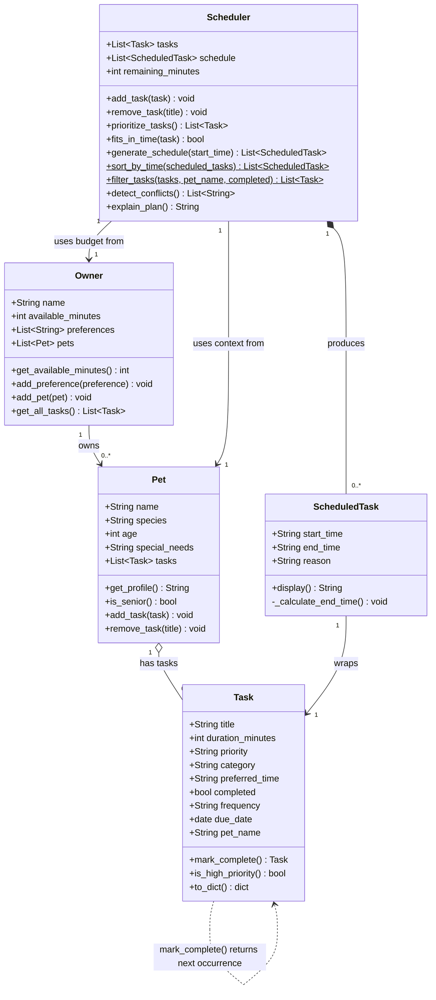

# PawPal+ — Final UML Class Diagram

> Copy the Mermaid block below into **https://mermaid.live**, then
> use **Export → PNG** to save `uml_final.png` in the project folder.

## What changed from the initial design

| # | Change | Why |
|---|---|---|
| 1 | `Owner` gained `pets`, `add_pet()`, `get_all_tasks()` | Tasks now flow Owner → Pet → Task; Scheduler pulls via `owner.get_all_tasks()` |
| 2 | `Pet` gained `tasks` list, `add_task()`, `remove_task()` | Tasks live on the pet they belong to, not directly on the Scheduler |
| 3 | `Task` gained `completed`, `frequency`, `due_date`, `pet_name` | Support for completion tracking, recurring tasks, and cross-pet filtering |
| 4 | `Task.mark_complete()` added with return type `Task` | Returns the next occurrence for daily/weekly tasks using `timedelta` |
| 5 | `Scheduler` gained `remaining_minutes` | Needed by `fits_in_time()` to track live budget as tasks are scheduled |
| 6 | `Scheduler.sort_by_time()` added (static `$`) | Sorts `ScheduledTask` list chronologically for display |
| 7 | `Scheduler.filter_tasks()` added (static `$`) | Filters task pool by `pet_name` and/or `completed` status |
| 8 | `Scheduler.detect_conflicts()` added | Pairwise overlap check; returns warning strings |
| 9 | `Pet o-- Task` relationship added | Replaces the old `Scheduler o-- Task`; tasks no longer live on the scheduler |
| 10 | `Task ..> Task` self-link added | Expresses that `mark_complete()` can produce a new `Task` instance |
